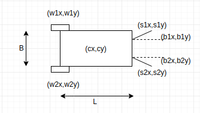
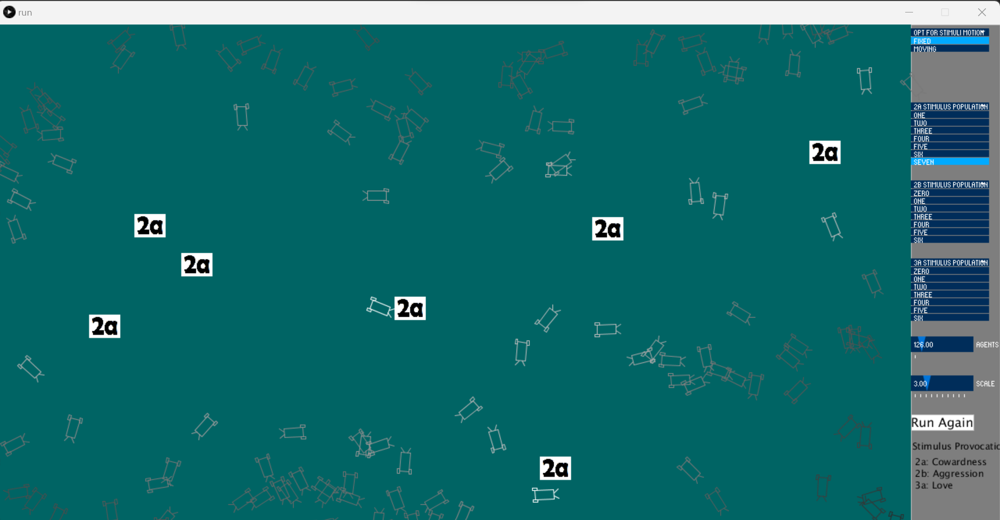
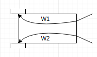
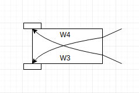

# Braintenberg Vehicles Simulations
## Content
### 1. What this is about?
### 2. The Braitenberg Vehicle
### 3. Simulation Environment
### 4. Wiring Rules and Activation Function
### 5. Vehicle Kinematics
### 6. Setting up and executing Processing.py code

## 1. What this is about?
This is the implementation of my Braitenberg Vehicle Simulation Project. The present simulation uses [Processing.py](https://py.processing.org/) for UI support. The code written here are based upon ideas described in the book by the neuroscientist [Valentino Braitenberg](https://en.wikipedia.org/wiki/Valentino_Braitenberg) in his classic book "Vehicles: Experiments in Synthetic Psychology" (1984). The book describes how hypothetical analog vehicles (a combination of sensors, actuators and their interconnections), though simple in design, can exhibit behaviors akin to aggression, love, foresight, and optimism. So, we would see these meaningful behaviours emerge from vehicles as they interact with stimuli in the environment through the programmed simulation.

<video src="doc/recordings/new/2a_avoiding-obstacles.mp4" controls="controls" style="max-width: 730px;">
</video>

## 2. The Braitenberg Vehicle
A Braitenberg vehicle is an agent that can autonomously move around based on its sensor inputs. It has primitive sensors that measure some stimulus at a point, and wheels (each driven by its own motor) that function as actuators or effectors.

Depending on how sensors and wheels are connected, the vehicle exhibits different behaviors (which can be goal-oriented). This means that, depending on the sensor-motor wiring, it appears to strive to achieve certain situations and to avoid others, changing course when the situation changes.

## 3. Simulation Environment
The environment consist of multiple number of vehicles and different kinds of stimuli. 
  
The stimuli are scattered throughout the environment which may or may not be moving. Their positions and movements rules are randomly generated values of a given range.
  
The vehicle’s initial positions are also randomly generated coordinates within the environment window. The movement of the vehicles is governed by the type of stimulus around and their proximity. So, the vehicle movement is completely dependent upon the stimuli around.

## 4. Wiring Rules and Activation Function
Each type of vehicle is characterized by these two properties being unique to them. By tweaking these properties we get different emergent behaviors and hence different names are assigned to the vehicles. The vehicle movement is particularly inspired by sensory activation received through its sensors and how this activation is transferred to the motor (Internal Wiring).
  
I have used the following expression as the sensory activation function, taking a variable “r” as the euclidean distance between sensor and stimulus.
   
A1 = k / ( k1 + k2 * r * r ), for non-inhibited activation, and
   
A2 = k / ( k1 + k2 * r * r ), for inhibited activation.
  
Where, k,k1,k2 are calibrated constants.

So, A1 is used in the case of 1A, 2A, 2B, while A2 is used in the case of 1B, 3A, 3B. Note that these are monotonic functions so for developing the next vehicles which have non-monotonic activation, some different activation function has to be used.
   
Talking about the internal wiring, these are merely two simple combinations between the pair of sensors and the wheels. I have defined weights for each internal connection between sensor and wheel. So, it’s very evident that for parallel connection, w1, w2, w3, w4 would be 1, 1, 0, 0 respectively. And for crossed connections, the weights corresponding to w1, w2, w3, w4 would be 1, 1, 0, 0. This can be clearly seen in the implemented code.
 

 

## 5. Vehicle Kinematics
Digging into the details of vehicle kinematics of Braitenberg Vehicles, we find that the only thing responsible for their movement is the rotation speed of the two wheels & the difference between them. 
 
More specifically, the difference in the rotation speed of the wheels is mainly responsible for deflection from its otherwise straight-line trajectory. So, depending upon the activation received at the wheel rotators and their difference, a resultant vehicle movement is rendered.
 

## 6. Setting up and executing Processing.py code
The code written here can be directly run on [Processing Software](https://processing.org/download/) installed on your PC. Make sure to opt for the python-mode while the elementary setup.

Alternatively, you make run these codes from terminal too and editing code in your favorite text editor. Follow the instructions on [this](https://py.processing.org/tutorials/command-line/) page.